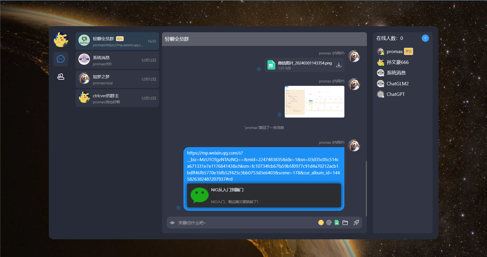

## 项目介绍

轻聊l聊天室是一款社交聊天软件，旨在为校园内的学生们提供一个实时交流的平台，从而促进校园信息的流通。同时，通过打破信息差，帮助大学生提升社交能力。

### 技术栈

| 技术                | 说明                                       | 官网                                                         |
| ------------------- | ------------------------------------------ | ------------------------------------------------------------ |
| SpringBoot          | web开发必备框架                            | https://spring.io/projects/spring-boot                       |
| MyBatis             | ORM框架                                    | http://www.mybatis.org/mybatis-3/zh/index.html               |
| MyBatisPlus         | 零sql，简化数据库操作，分页插件            | https://baomidou.com/                                        |
| Redis               | 缓存加速，多数据结构支持业务功能           | [https://redis.io](https://redis.io/)                        |
| Caffeine            | 本地缓存                                   | http://caffe.berkeleyvision.org/                             |
| Nginx               | 负载均衡，https配置，websocket升级，ip频控 | [https://nginx.org](https://nginx.org/)                      |
| Docker              | 应用容器引擎                               | [https://www.docker.com](https://www.docker.com/)            |
| Oss                 | 对象存储                                   | https://letsencrypt.org/                                     |
| Jwt                 | 用户登录，认证方案                         | [https://jwt.io](https://jwt.io/)                            |
| Lombok              | 简化代码                                   | [https://projectlombok.org](https://projectlombok.org/)      |
| Hutool              | Java工具类库                               | https://github.com/looly/hutool                              |
| Swagger-UI          | API文档生成工具                            | https://github.com/swagger-api/swagger-ui                    |
| Hibernate-validator | 接口校验框架                               | [hibernate.org/validator/](https://github.com/zongzibinbin/MallChat/blob/main/hibernate.org/validator) |
| minio               | 自建对象存储                               | https://github.com/minio/minio                               |

### 主要功能

其主体业务是围绕聊天展开，其中主要实现功能有：

1、借助微信开放平台 API，通过微信扫码登录，实现 Channel 与 OpenID 的关联，并以带参二维码

方式呈现。

2、结合KMP算法和Trie思想构建AC自动机，实现敏感词过滤，不断优化算法提高过滤精度，并将耗时控制

在万级纳秒以内。

3、结合AOP 和封装 Starter，实现 Token 解析、请求上下文存储，黑名单拦截以及接口日志记录。

4、基于 Redisson，封装编程式和注解式的分布式锁工具。精简加锁操作，规范使用，并避免不当使用带来的问题。

5、结合 SpringEl 与 Redis 实现频控注解，支持对入参，ip，uid，等维度的频率控制，支持固定窗口，滑动窗口等频控策略。

6、集中管理项目线程池，采用异步执行优化接口响应速度。确保线程池的异常捕获与优雅停机，提升系统稳定性。

7、基于模板方法模式，打造支持 Cafeine、 Redis 和混合的二级缓存框架。特别支持 Keys 的差集缓存，提升易用性。

8、针对全员群人数过万，写扩散系数爆炸，用户会话采用推拉结合的方式加载消息。

9、针对消息、成员和会话列表，避免深翻页和频繁变动问题。引入游标翻页机制，约定前后端交互逻辑，封装 MySQL 的翻页工具类，简化游标翻页实现。

10、优化消息已读未读列表的数据库设计，仅记录用户阅读时间线，有效避免消息存储指数级增长。

11、采用 RocketMQ 进行消息广播，Websocket 服务过连接消息，实现进的消息推送。

12、消息中的 url 解析小卡片，不同类型链接有不同解析方式，采用策略模式，封装多种解析方法。采用责任链模式串联解析流程。采用模板方法模式，搭建解析基础骨架。采用 CompletableFuture 并行解析多 url。并借助 Jsoup 的请求超时，进行熔断，避免过长的耗时。

### 项目运行截图

